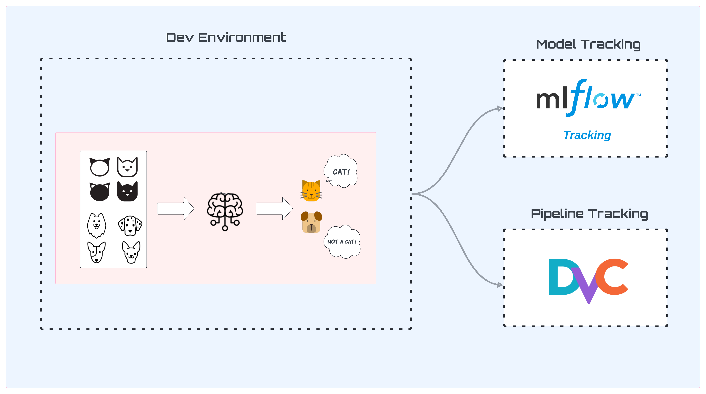

# End-to-End Image Classification using MLflow

---

This project contains end-to-end development of image classification model. It uses **MLflow** for tracking the model performance on different hyperparameters. In addition to this, we also use **DVC** (Data Version Control) for version control of data and models.   

### Links:
- [MLflow](https://mlflow.org)
- [DVC](https://dvc.org)
- [Kaggle Dataset](https://www.kaggle.com/datasets/erkamk/cat-and-dog-images-dataset?select=Dog+and+Cat+.png)
